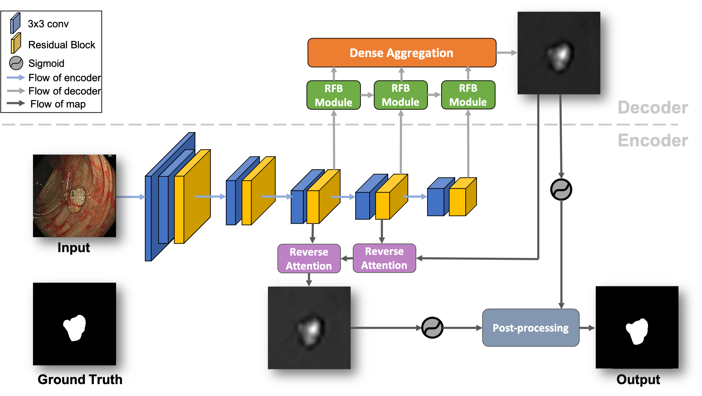

# DarkraNet: A Encoder-Decoder and Reverse Attention Network for Real-time Polyp Segmentation in NBI and WL Colonoscopy
## DarkraNet Architecture
<p align="center">  </p> 

## Results

## Usage

### 1.  Clone this repository

```
git clone https://github.com/r08945002/DarkraNet.git
cd DarkraNet
```


### 2.  Data download

- Training data:
  
  For Linux users, simply use the following command.

  ```
  wget -O Polyp_dataset.zip 'https://www.dropbox.com/sh/ywf3wj4eblne8uy/AAAUjyUCfFUzIGOcR2Rv7-ESa'
  unzip Polyp_dataset.zip -d ./Polyp_dataset
  ```
  
  
  Or download training data [[download here]](https://www.dropbox.com/sh/ywf3wj4eblne8uy/AAAUjyUCfFUzIGOcR2Rv7-ESa) and move it into your data_dir. 


- Test data:

  For Linux users, simply use the following command.

  ```
  gdown --id 1o8OfBvYE6K-EpDyvzsmMPndnUMwb540R
  unzip TestDataset.zip
  ```
  
  Or download training data [[download here]](https://drive.google.com/file/d/1o8OfBvYE6K-EpDyvzsmMPndnUMwb540R/view?usp=sharing) and move it into your data_path.  


### 3.  Training

- Download the pretrained weight of the encoder (DarkNet53):

  ```
  wget model_best.pth.tar 'https://www.dropbox.com/s/hg2fmuc1ivbome6/model_best.pth.tar'
  ```

- Start training:

  ```
  python3 train_segmentation.py
  ```

  > ⚠️ ***IMPORTANT NOTE*** ⚠️  
  > Make sure your training data is in the right path.  
  > Be sure there is a folder called `Polyp_dataset` under the root directory of your local repository.


### 4.  Testing

- Download the best weight of DarkraNet we trained:

  ```
  wget DarkraNet_final.pth 'https://www.dropbox.com/s/p4c2ysby8p14ucv/DarkraNet_final.pth'
  ```

- Start testing:

  ```
  cp -r ./Polyp_dataset/NBI ./TestDataset
  python3 test_segmentation.py
  ```
  > ⚠️ ***IMPORTANT NOTE*** ⚠️  
  > Make sure your have copied the `NBI` folder to the `TestDataset` folder so that you can predict the result of  `NBI` dataset. 
  > You can also put your best model weight path in `test_segmentation.py` line 70.       
  

### 5.  Evaluation

- After predicting segmentation maps, you can run the following command to evaluate the performance of DarkraNet:

  ```
  python3 eval.py
  ```

### 6.  Demo on colonoscopy video


### 7.  Speed

- Test the speed of DarkraNet:

  ```
  python3 speed.py
  ```

## Acknowledgement

- A large part of the code is inspired by:

  **DarkNet53** [[github]](https://github.com/developer0hye/PyTorch-Darknet53) [[paper]](https://arxiv.org/abs/1804.02767)      
  **PraNet** [[github]](https://github.com/DengPingFan/PraNet) [[paper]](https://arxiv.org/abs/2006.11392)                    
  **RFBNet** [[github]](https://github.com/ruinmessi/RFBNet) [[paper]](https://arxiv.org/abs/1711.07767)                 
  **RAS-pytorch** [[github]](https://github.com/ShuhanChen/RAS-pytorch) [[paper]](https://arxiv.org/abs/1807.09940)             
#### 👏🏻 Thanks for their amazing works.  


